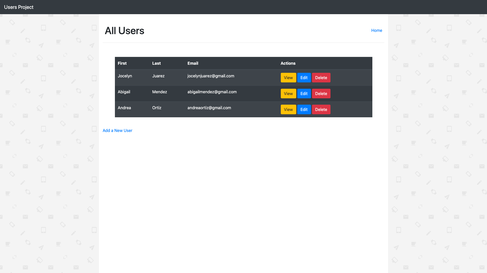
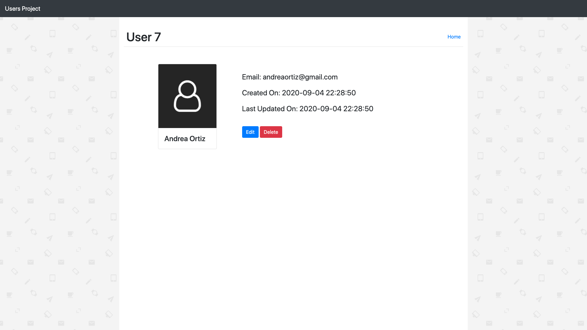
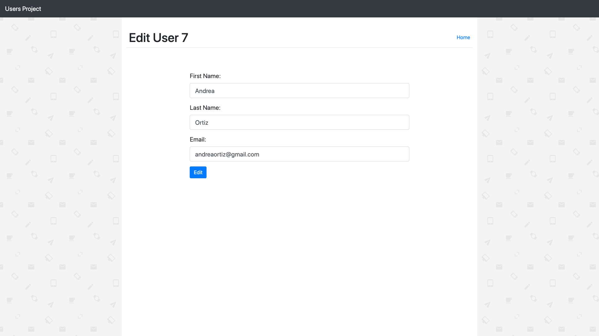
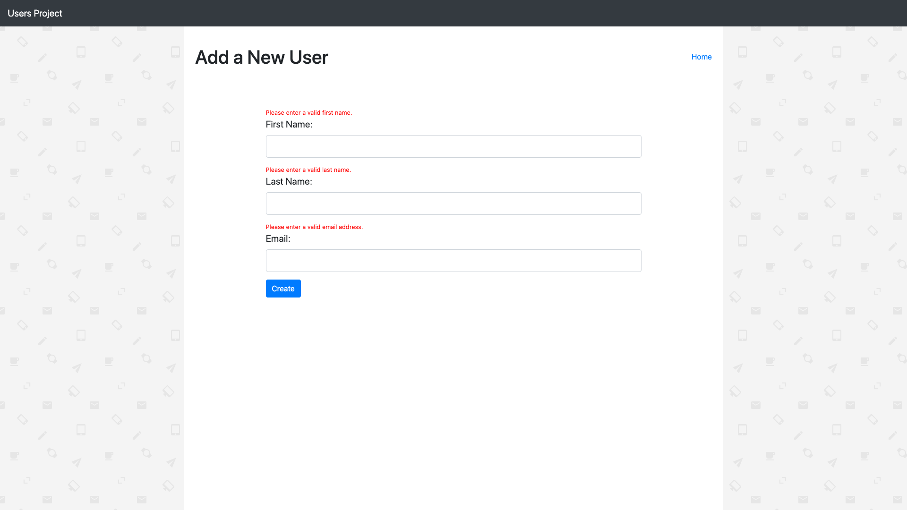

# FlaskUsers
A page dedicated to creating and keeping track of current and new users. When creating a new user the web page validates the information before sending it to the database, if its valid the request will go through and a new user will be added, else it will ask to re-submit the user information. In addition, when creating a new user the webpage will check in real time using AJAX to see if the email being inputed is available. Once a user is created they can be viewed, edited or deleted. 

# What I learned
* Practice Flask
* Incorporate SQL Database
* SQL Queries
* Form Validations
* String Pattern Regex
* Password Encryption 
* AJAX and Partials

 
# Screenshots

